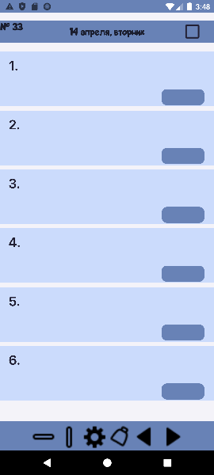
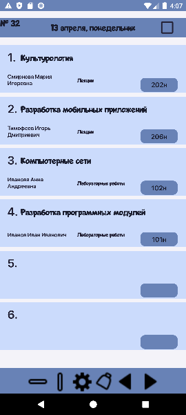
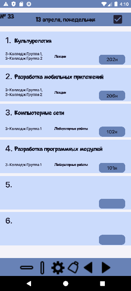
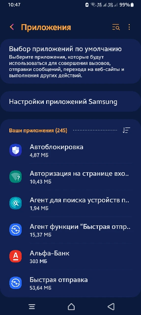
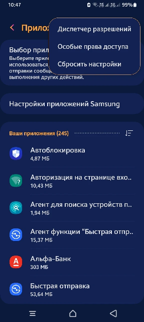
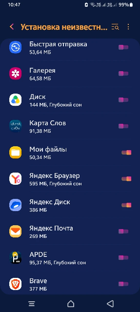
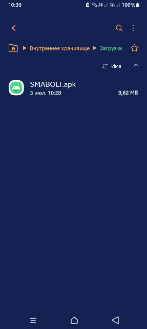
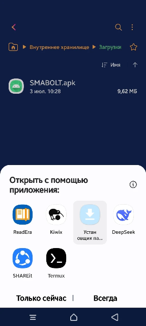
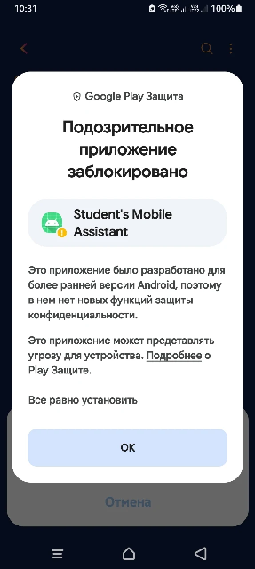
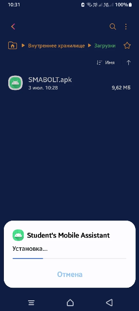

# Приложение-расписание для СамГТУ

Приложение просмотра расписания на Android для студентов и преподавателей РФ в колледже и университете СамГТУ.

## Оглавление

- [📱 Скриншоты](#скриншоты)
- [📦 Установка](#установка)
- [🛠 Технологии](#технологии)️
- [👨‍💻 Для разработчико(#д Д-я разработчиковов)

## 📱 Скриншоты

*Главный экран при первом запуске*

*Главный экран с загруженным расписанием*

*Главный экран с расписанием и версией преподавателя**Главный экран с расписанием и версией преподавателя*

## 📦 Установка

1. **Скачайте последнюю версию APK-файла** из раздела [Releases](https://github.com/DiconaFox/SMABOLT/releases).
2. После скачивания APK **нажмите на файл в папке "Загрузки"** в телефоне.
3. **Разрешите установку из неизвестных источников** (нужно только один раз):
   - Нажмите на скачанный файл.
   - Телефон попросит разрешить установку.
   - Нажмите **«Настройки»** → включите **«Разрешить установку из этого источника».**

> ⚠️Следующее ппредупреждение**"Подозрительное приложение заблокировано"**  появляется потому, что приложение установлено не из Google Play.** Я гарантирую, что оно безопасн!** Ввесь код открыт и доступен в этом репозитори..

3. **Нажмите на файл в папке "Загрузки"** в телефоне.

4. Появится окно **«Подозозрительное приложение заблокировано»** — нажмите **«Подробнее»** и далее нажмите **«Всё равно установить»**.

5. Дождитесь завершения установки.

6. После установки нажмите **«Готово»** или **«Открыть»** приложение.

7. Осуществляйте загрузку расписания по инструкции по кнопке "Настройки"

🛠️ Более подробная инструкция по установке (с картинками)

*Как разрешить установку из неизвестных источников*

*Как разрешить установку приложения*

## 🛠️ Технологии

- Java
- SQLite
- Парсинг HTML-страницы

## 👨‍💻 Для разработчиков

Технические детали

(технологии, структура, принцип работы)

В работе приложения задействован алгоритм парсинга HTML страницы путём перелистывания каждой и считывания данных с неё. Далее происходит запись в базу данных, которая впоследствии используется для загрузки расписания в главное меню приложения.
Процесс загрузки расписания происходит с задержкой для имитации действий пользователя. Это временное решение, которое в будущем планируется переделать в фоновый сервис.

